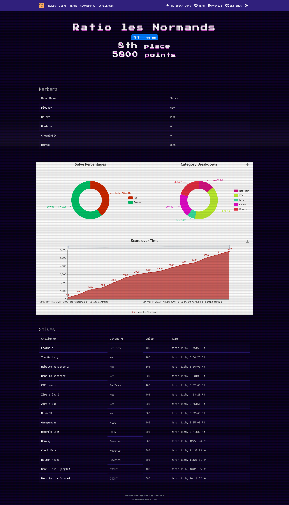

# ZiTF 2023 - **Birsol** - Team `Ratio les Normands`

## Voici le Writeup de mon premier CTF, l'édition 2023 du ZiTF.

### Le ZiTF 2023 comptait `35` challenges. Avec mon équipe, nous avons réussi à en compléter `15`, ce qui nous a mené à la `8e` place sur les `33` équipes participantes.

### J'ai personnellement réussi à obtenir `3200` points, en complétant `8` challenges.

### Voici le détail du score de l'équipe

### Nous avons également été la première équipe à compléter un challenge !

### Plus d'informations et le scoreboard général sur https://ctf.zitf.fr.

### Merci à eux d'avoir organisé cet évènement.

### Voici également le Writeup d'un membre de mon équipe, **Walbre** : https://github.com/Walbre/zitf-2023